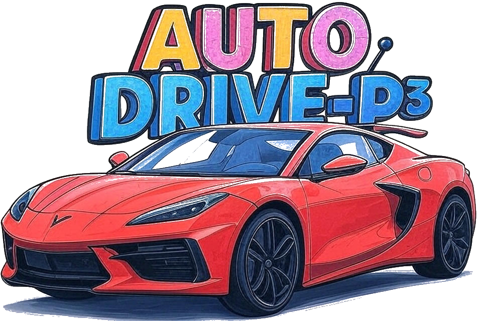

<div align="center">

</div>

# AutoDrive-P³: Unified Chain of Perception–Prediction–Planning Thought via Reinforcement Fine-Tuning

<div align="center">
  <a href="https://openreview.net/forum?id=CMU8GxwpUL">
    
  </a>
  <a href="https://github.com/haha-yuki-haha/AutoDrive-P3">
    
  </a>
</div>

## 📖 Overview

This is the official implementation of the paper "AutoDrive-P³: Unified Chain of Perception–Prediction–Planning Thought via Reinforcement Fine-Tuning", accepted at ICLR 2026 🎉. 


## 📅 Release Planning ✅

### 🗓️ nuScenes Open source schedule

| Item | Time | State |
|------|----------|------|
| 📊 **Dataset** | 2026.03/04 | 🟡 Soon |
| 💻 **Code** | 2026.03/04 | 🟡 Soon |
| 🎯 **Checkpoint** | 2026.03/04 | 🟡 Soon |


### 📦 NAVSIM Open source schedule

| Item | Time | State |
|------|----------|------|
| 🗂️ **Dataset** | 2026.03/04 | 🟡 Soon |
| 📝 **Code** | 2026.03/04 | 🟡 Soon |
| ⚙️ **Checkpoint** | 2026.03/04 | 🟡 Soon |


## 📬 Contact
If you have any questions, please contact Yuqi Ye via Email (yeyuqi0303@stu.pku.edu.cn) or WeChat (yuki-hahaha-yuki).

## 📚 Citation

If you find this work useful for your research, please cite our paper:

```bibtex
@inproceedings{
ye2026autodrivetextp,
title={{\$AutoDrive{\textbackslash}text\{-\}P{\textasciicircum}3\$}: Unified Chain of Perception{\textendash}Prediction{\textendash}Planning Thought via Reinforcement Fine-Tuning},
author={Yuqi Ye and Zijian Zhang and Junhong Lin and Shangkun Sun and Changhao Peng and Wei Gao},
booktitle={The Fourteenth International Conference on Learning Representations},
year={2026},
url={https://openreview.net/forum?id=CMU8GxwpUL}
}
```
Main Authors: Yuqi Ye (yeyuqi0303@stu.pku.edu.cn), Zijian Zhang (zijianzhang25@stu.pku.edu.cn). 

Corresponding Author: Wei Gao (gaowei262@pku.edu.cn).


## 🙏 Acknowledgements

This work was supported by [EadyR1](https://github.com/hiyouga/EasyR1), [trl](https://github.com/huggingface/trl).
